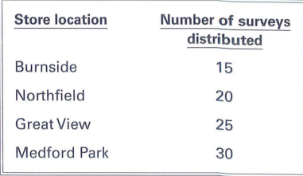

# 📘 Lesson 12 – Practice

---

## 🎧 Part 3: Listening Comprehension

### 🔊 Questions 1–3

**[W-Am]**
Have you made your flight reservations for the National Marketing Conference yet?

**[M-Cn]**
Actually, I just canceled them. We had to cut part of our travel budget because sales have been down the past three months.

**[W-Am]**
But I thought you were going to lead a question and answer session on online marketing.

**[M-Cn]**
I've asked Miguel Fernandez from the local office to go instead. They're close by so he can fill in for me.

#### 📝 Questions & Answers
1. **What are the speakers discussing?**  
   **A.** A budget proposal  
   **B.** A conference  
   **C.** A marketing report  
   **D.** A training session  
   👉 **Answer: B**  
> **Explanation:** The speakers are talking about flight reservations and budget cuts for the **National Marketing Conference**.

2. **Why did the man cancel his plans?**  
   **A.** He is sick  
   **B.** He has another meeting  
   **C.** His budget has been reduced  
   **D.** His flight was delayed  
   👉 **Answer: C**  
> **Explanation:** The man mentions that they had to **cut part of their travel budget** because sales have been down.

3. **What did the man ask Miguel Fernandez to do?**  
   **A.** Prepare a report  
   **B.** Organize a meeting  
   **C.** Contact a client  
   **D.** Represent the company at an event  
   👉 **Answer: D**  
> **Explanation:** The man asked Miguel to go to the conference **instead of him**, which means representing the company at the event.

---

### 🔊 Questions 4–6

**[W-Br]**
Luis, our summer vacation package sales were low in June.

**[M-Au]**
Well, we'll start running a new advertisement soon. We should see more sales in a few weeks.

**[W-Br]**
Yeah, but summer's almost over.

**[M-Au]**
You're right. We really should have more summer vacations booked by now.

**[W-Br]**
I have an idea. Let's talk to our hotel and transportation vendors about putting together more two- and three-day package tours. That'll attract people who just want a short getaway.

**[M-Au]**
That could work! I'll start calling our vendors right away and see what they can do.

#### 📝 Questions & Answers
4. **Where do the speakers most likely work?**  
   **A.** At a travel agency  
   **B.** At a hotel  
   **C.** At a restaurant  
   **D.** At a transportation company  
   👉 **Answer: A**  
> **Explanation:** The speakers are discussing summer vacation package **sales** and calling **hotel/transportation vendors**, which are typical tasks at a **travel agency**.

5. **What does the woman imply when she says "but summer's almost over"?**  
   **A.** They should cancel the advertisement  
   **B.** They should extend the summer season  
   **C.** An advertisement will come out too late  
   **D.** The weather has been unusual  
   👉 **Answer: C**  
> **Explanation:** The man suggests running a new ad, but the woman worries it's too late because summer is ending, implying the **ad will not be effective**.

6. **What will the man do next?**  
   **A.** Review a report  
   **B.** Talk to customers  
   **C.** Plan a vacation  
   **D.** Call some vendors  
   👉 **Answer: D**  
> **Explanation:** The man explicitly says, "I'll start **calling our vendors** right away."

---

### 🔊 Questions 7–9

**[W-Am]**
Hi, Jeff, have you submitted your article on seabirds to any science journals yet?

**[M-Cn]**
Yes, in fact, I just heard yesterday that Science Monthly will publish my paper in their next issue.

**[W-Am]**
Congratulations! I have a subscription to that journal—I can't wait to read your article when it comes out. This must be a big step for your research project.

**[M-Cn]**
It's definitely good news. People will be able to read about my work. Then, when we meet at the summer conference, we can have some good discussions about the project.

#### 📝 Questions & Answers
7. **Who most likely is the man?**  
   **A.** A researcher  
   **B.** A journalist  
   **C.** A professor  
   **D.** A student  
   👉 **Answer: A**  
> **Explanation:** The man mentions his **article on seabirds** and his **research project**, indicating he is a **researcher**.

8. **Why does the woman congratulate the man?**  
   **A.** He received a promotion  
   **B.** His article will be published  
   **C.** He completed a project  
   **D.** He won an award  
   👉 **Answer: B**  
> **Explanation:** The woman congratulates him because **Science Monthly will publish his paper** in their next issue.

9. **What does the man plan to do this summer?**  
   **A.** Travel abroad  
   **B.** Attend a conference  
   **C.** Start a new project  
   **D.** Teach a class  
   👉 **Answer: B**  
> **Explanation:** The man mentions, "when we **meet at the summer conference**," indicating his plan.

---

### 🔊 Questions 10–12

**[W-Am]**
Hello. My name is Heidi Park, and I'm a reporter from Modern Architect Magazine. I'm here to see Mr. Mitra. I'm supposed to interview him at eleven thirty.

**[M-Cn]**
OK. I'll let him know you're here. In the meantime, can you please sign in? We keep track of all visitors' appointments.

**[W-Am]**
Sure. No problem.

**[M-Cn]**
Mr. Mitra is on his way down to meet you. Oh, here he is now! Mr. Mitra, this is Heidi Park, your eleven thirty appointment.

**[M-Au]**
Hi, Ms. Park. Thanks for coming. I'm so sorry, but I need a few more minutes before we meet. I have to respond to an urgent phone call.

#### 📝 Questions & Answers
10. **Why is the woman meeting Mr. Mitra?**  
    **A.** To conduct an interview  
    **B.** To attend a meeting  
    **C.** To apply for a job  
    **D.** To deliver a document  
    👉 **Answer: A**  
> **Explanation:** The woman says she is a reporter and is "supposed to **interview him** at eleven thirty."

11. **What does the woman agree to do?**  
    **A.** Wait in the lobby  
    **B.** Sign in for a visit  
    **C.** Call back later  
    **D.** Fill out a form  
    👉 **Answer: B**  
> **Explanation:** The man asks her to **sign in**, and she responds, "Sure. No problem."

12. **Why does Mr. Mitra apologize?**  
    **A.** He forgot about the appointment  
    **B.** He is leaving early  
    **C.** He made a mistake  
    **D.** He will be late for a meeting  
    👉 **Answer: D**  
> **Explanation:** Mr. Mitra says, "I need a few more minutes before we meet," which means he will be **late for their meeting**.

---

### 🔊 Questions 13–15

**[W-Am]**
Hi, Hank. I'm back from our Product Development Lab. They're wondering how the taste-test surveys for our new flavors of juice drinks are coming along.

**[M-Cn]**
Oh, our market research firm sent us 30 completed surveys from another supermarket testing site, just this morning.

**[W-Am]**
Great. Why don't you get in touch with our advertising agency? If the survey results are positive, they can be used in our new ads.

**[M-Cn]**
Sure—so far the feedback seems good. These 30 surveys came from the Medford Park Supermarket. So we're just waiting on one more set of results.

**[W-Am]**
OK. Which supermarket still hasn't sent us their surveys?

**[M-Cn]**
That would be Burnside, but they received their product samples late. They expect to send us all their surveys tomorrow.

#### 📝 Questions & Answers
13. **Where do the speakers most likely work?**  
    **A.** At a supermarket  
    **B.** At a beverage company  
    **C.** At a research institute  
    **D.** At an advertising agency  
    👉 **Answer: B**  

14. **What does the woman suggest the man do?**  
    **A.** Contact a supermarket  
    **B.** Review survey results  
    **C.** Contact an advertising agency  
    **D.** Develop a new product  
    👉 **Answer: C**  

*Graphic for Question 15*

15. **Look at the graphic. How many surveys are the speakers waiting to receive?**  
    **A.** 15  
    **B.** 20  
    **C.** 25  
    **D.** 30  
    👉 **Answer: A**  

> **Explanation:** The man mentions that they are still waiting for surveys from the **Burnside** supermarket. According to the graphic, the number of surveys for Burnside is **15**. Therefore, the speakers are waiting to receive 15 surveys.

---

## 📖 Part 6-7: Reading Comprehension

### 📄 Questions 131–134 (Original Exercise)

> **Thank you for shopping with Danforth Fashions online.**
>
> Our quality-control team carefully inspects all products **<u>&nbsp;&nbsp;&nbsp;&nbsp;(131)&nbsp;&nbsp;&nbsp;&nbsp;</u>** packaging to ensure customer satisfaction. **<u>&nbsp;&nbsp;&nbsp;&nbsp;(132)&nbsp;&nbsp;&nbsp;&nbsp;</u>**. If not, we make exchanges or returns easy. Simply contact us at `service@danforthfashions.com` if you need a different size, a color, or pattern—or if you are dissatisfied for any reason. Your exchange **<u>&nbsp;&nbsp;&nbsp;&nbsp;(133)&nbsp;&nbsp;&nbsp;&nbsp;</u>** right away.
>
> To return an item for a refund, use the prepaid return shipping label included with your order and send it back to us in its original packaging unused and undamaged. We issue refunds to the original method of payment, **<u>&nbsp;&nbsp;&nbsp;&nbsp;(134)&nbsp;&nbsp;&nbsp;&nbsp;</u>** the return shipping fee.

**Options:**  
   **(131)**  
   (A) in case  
   (B) as much as  
   (C) prior to  
   (D) in keeping with  

   **(132)**  
   (A) We hope you are entirely pleased with your purchase.  
   (B) We expect to be redesigning our Website this summer.  
   (C) We value all of our loyal customers.  
   (D) We noticed that your billing address has changed.  

   **(133)**  
   (A) will be processed  
   (B) was processed  
   (C) is processing  
   (D) to be processing  

   **(134)**  
   (A) past  
   (B) above  
   (C) aboard  
   (D) minus  

---

### 📄 Questions 131–134 (Completed Version)
> **Thank you for shopping with Danforth Fashions online.**
>
> Our quality-control team carefully inspects all products **<u>prior to</u>** (131) packaging to ensure customer satisfaction. **<u>We hope you are entirely pleased with your purchase.</u>** (132). If not, we make exchanges or returns easy. Simply contact us at `service@danforthfashions.com` if you need a different size, a color, or pattern—or if you are dissatisfied for any reason. Your exchange **<u>will be processed</u>** (133) right away.
>
> To return an item for a refund, use the prepaid return shipping label included with your order and send it back to us in its original packaging unused and undamaged. We issue refunds to the original method of payment, **<u>minus</u>** (134) the return shipping fee.

#### 📝 Vocabulary & Analysis
- **Quality-control team:** Đội ngũ kiểm soát chất lượng.
- **Inspect:** Kiểm tra kỹ lưỡng.
- **Prior to:** = *Before* (Trước khi).
- **Ensure customer satisfaction:** Đảm bảo sự hài lòng của khách hàng.
- **Entirely pleased:** Hoàn toàn hài lòng.
- **Exchange:** Đổi hàng / **Return:** Trả hàng.
- **Pattern:** Mẫu mã, hoa văn.
- **Dissatisfied:** Không hài lòng.
- **Process right away:** Xử lý ngay lập tức.
- **Refund:** Hoàn tiền.
- **Prepaid return shipping label:** Nhãn vận chuyển trả hàng đã trả tiền trước.
- **Original packaging:** Bao bì gốc.
- **Unused and undamaged:** Chưa dùng và không hỏng.
- **Original method of payment:** Phương thức thanh toán ban đầu.
- **Return shipping fee:** Phí vận chuyển trả hàng.

#### 💡 Key Takeaways:
1.  **Exchanges** (đổi hàng) are processed immediately for size/color issues.
2.  **Refunds** (hoàn tiền) require the item to be unused, undamaged, and in original packaging.
3.  The **shipping fee** will be deducted from the total refund amount (*minus the return shipping fee*).

---

### 📢 Questions 135–138 (Original Exercise)

> **Attention, Alden-Apper Industries Employees!**
>
> Please remember that the switch to our new e-mail software will begin at 11:00 P.M. on Sunday, May 2. All **<u>&nbsp;&nbsp;&nbsp;&nbsp;(135)&nbsp;&nbsp;&nbsp;&nbsp;</u>** information in your account, including contacts and calendar events, will be moved to the new system by 4:00 A.M. on Monday, May 3.
>
> Though we are working diligently to anticipate and provide solutions for all potential issues, some employees may experience difficulty **<u>&nbsp;&nbsp;&nbsp;&nbsp;(136)&nbsp;&nbsp;&nbsp;&nbsp;</u>** attempting to log in to their accounts after the switch. In addition, there is a remote possibility that some information may be lost. **<u>&nbsp;&nbsp;&nbsp;&nbsp;(137)&nbsp;&nbsp;&nbsp;&nbsp;</u>**, be sure to back up any critical e-mail files as soon as possible. **<u>&nbsp;&nbsp;&nbsp;&nbsp;(138)&nbsp;&nbsp;&nbsp;&nbsp;</u>**.
>
> A training session will be scheduled next week to familiarize employees with key functions of the new software.
>
> If you need assistance with this, please contact the IT department.

**Options:**  
   **(135)**  
   (A) existed  
   (B) existence  
   (C) to exist  
   (D) existing  

   **(136)**  
   (A) when  
   (B) plus  
   (C) already  
   (D) whose  

   **(137)**  
   (A) Previously  
   (B) Otherwise  
   (C) Even so  
   (D) For this reason  

   **(138)**  
   (A) The new software will be ordered this week.  
   (B) The current system will be reactivated in June.  
   (C) If you need assistance with this, please contact the IT department.  
   (D) In that case, you must complete the installation yourself.  

---

### 📢 Questions 135–138 (Completed Version)
> **Attention, Alden-Apper Industries Employees!**
>
> Please remember that the switch to our new e-mail software will begin at **11:00 P.M. on Sunday, May 2**. All **<u>existing</u>** (135) information in your account, including contacts and calendar events, will be moved to the new system by **4:00 A.M. on Monday, May 3**.
>
> Though we are working diligently to anticipate and provide solutions for all potential issues, some employees may experience difficulty **<u>when</u>** (136) attempting to log in to their accounts after the switch. In addition, there is a remote possibility that some information may be lost. **<u>For this reason</u>** (137), be sure to **back up any critical e-mail files** as soon as possible. **<u>If you need assistance with this, please contact the IT department.</u>** (138).
>
> A training session will be scheduled next week to familiarize employees with key functions of the new software.
>
> If you need assistance with this, please contact the IT department.

#### 📝 Vocabulary & Analysis
- **Switch to:** Chuyển đổi sang (hệ thống/phần mềm mới).
- **Existing information:** Thông tin hiện có/đang tồn tại.
- **Diligently:** Cần mẫn, siêng năng.
- **Anticipate potential issues:** Dự đoán/lường trước các vấn đề tiềm ẩn.
- **Remote possibility:** Khả năng xa vời/mong manh.
- **Back up critical files:** Sao lưu các tập tin quan trọng.
- **Familiarize employees with:** Giúp nhân viên làm quen với.

#### 💡 Key Takeaways:
1. The email system migration takes place between **Sunday night and Monday morning**.
2. **Backing up files** is strongly recommended as a precaution against data loss.
3. Training sessions will be provided to help staff use the new software.

---

### ✉️ Questions 139–142 (Original Exercise)

> **Dear Director Yoshida,**
>
> Thank you for your school's interest in visiting our farm next month. Please note that children must be at least six years old to visit and tour the farm. **<u>&nbsp;&nbsp;&nbsp;&nbsp;(139)&nbsp;&nbsp;&nbsp;&nbsp;</u>**. I have enclosed a list of the **<u>&nbsp;&nbsp;&nbsp;&nbsp;(140)&nbsp;&nbsp;&nbsp;&nbsp;</u>** activities available for our young visitors. Two of these **<u>&nbsp;&nbsp;&nbsp;&nbsp;(141)&nbsp;&nbsp;&nbsp;&nbsp;</u>** must be scheduled in advance. They are a cheese-making class and an introduction to beekeeping. Both are very popular with our visitors.
>
> Please let **<u>&nbsp;&nbsp;&nbsp;&nbsp;(142)&nbsp;&nbsp;&nbsp;&nbsp;</u>** know your selection by early next week. I look forward to welcoming your group soon!
>
> Sincerely,
> **Annabel Romero**
> Coordinator, Merrytree Family Farm

**Options:**  
   **(139)**  
   (A) In the event of bad weather, the animals will be inside.  
   (B) There are no exceptions to this policy.  
   (C) Ones younger than that can find much to enjoy.  
   (D) This fee includes lunch and a small souvenir.  

   **(140)**  
   (A) legal  
   (B) artistic  
   (C) athletic  
   (D) educational  

   **(141)**  
   (A) events  
   (B) plays  
   (C) treatments  
   (D) trips  

   **(142)**  
   (A) they  
   (B) me  
   (C) her  
   (D) one  

---

### ✉️ Questions 139–142 (Completed Version)
**To:** Director Yoshida  
**From:** Annabel Romero  

> Dear Director Yoshida,
>
> Thank you for your school's interest in visiting our farm next month. Please note that children must be at least six years old to visit and tour the farm. **<u>There are no exceptions to this policy.</u>** (139). I have enclosed a list of the **<u>educational</u>** (140) activities available for our young visitors. Two of these **<u>events</u>** (141) must be scheduled in advance. They are a cheese-making class and an introduction to beekeeping. Both are very popular with our visitors.
>
> Please let **<u>me</u>** (142) know your selection by early next week. I look forward to welcoming your group soon!
>
> Sincerely,
> **Annabel Romero**
> Coordinator, Merrytree Family Farm

#### 📝 Vocabulary & Analysis
- **No exceptions to this policy:** Không có ngoại lệ đối với chính sách này (quy tắc nghiêm ngặt).
- **At least:** Ít nhất.
- **Enclosed:** Được gửi kèm theo.
- **Educational activities:** Các hoạt động mang tính giáo dục.
- **In advance:** Trước (về mặt thời gian).
- **Beekeeping:** Nuôi ong.

#### 💡 Key Takeaways:
1. The farm tour has a **strict age policy** (minimum 6 years old).
2. Special activities like cheese-making and beekeeping require **prior booking**.
3. A list of available educational activities is provided in the letter.

---

### 🌴 Questions 143–146 (Original Exercise)

> **Jamaica National Tourist Organization Offers Free Cultural Passes**
>
> The Jamaica National Tourist Organization (JAMTO) announces an exciting new program that provides free entry to a variety of cultural attractions. The program is sponsored by the JAMTO **<u>&nbsp;&nbsp;&nbsp;&nbsp;(143)&nbsp;&nbsp;&nbsp;&nbsp;</u>** the hotels and businesses listed on the back of this flyer. Together, we **<u>&nbsp;&nbsp;&nbsp;&nbsp;(144)&nbsp;&nbsp;&nbsp;&nbsp;</u>** you to take advantage of some of the finest cultural and educational experiences that Jamaica has to offer. **<u>&nbsp;&nbsp;&nbsp;&nbsp;(145)&nbsp;&nbsp;&nbsp;&nbsp;</u>** attractions include the Caribbean National Gardens, Montego Bay Potters Gallery, Jamaican Music Experience, and many others.
>
> To obtain your pass, visit our Web site at [www.jamto.org/freepass](http://www.jamto.org/freepass) or stop by any JAMTO office. One pass is valid for up to five people. **<u>&nbsp;&nbsp;&nbsp;&nbsp;(146)&nbsp;&nbsp;&nbsp;&nbsp;</u>**.

**Options:**  
   **(143)**  
   (A) despite  
   (B) instead of  
   (C) except for  
   (D) along with  

   **(144)**  
   (A) invite  
   (B) invited  
   (C) may invite  
   (D) were inviting  

   **(145)**  
   (A) Early  
   (B) Past  
   (C) Affordable  
   (D) Participating  

   **(146)**  
   (A) Thank you for your order.  
   (B) It can be used for three days.  
   (C) The bus runs only on weekdays.  
   (D) All major credit cards are accepted.  

---

### 🌴 Questions 143–146 (Completed Version)
> **Jamaica National Tourist Organization Offers Free Cultural Passes**
>
> The Jamaica National Tourist Organization (JAMTO) announces an exciting new program that provides free entry to a variety of cultural attractions. The program is sponsored by the JAMTO **<u>along with</u>** (143) the hotels and businesses listed on the back of this flyer.
>
> Together, we **<u>invite</u>** (144) you to take advantage of some of the finest cultural and educational experiences that Jamaica has to offer. **<u>Participating</u>** (145) attractions include:
> Caribbean National Gardens  
> Montego Bay Potters Gallery  
> Jamaican Music Experience  
> And many others.  
>
> To obtain your pass, visit our website at [www.jamto.org/freepass](http://www.jamto.org/freepass) or stop by any JAMTO office. One pass is valid for up to **five people**. **<u>It can be used for three days.</u>** (146).

#### 📝 Vocabulary & Analysis
- **Free entry:** Vào cửa miễn phí.
- **Variety of cultural attractions:** Nhiều điểm tham quan văn hóa đa dạng.
- **Sponsored by:** Được tài trợ bởi.
- **Along with:** Cùng với.
- **Take advantage of:** Tận dụng/Khai thác lợi ích từ.
- **Participating attractions:** Các điểm tham quan tham gia chương trình.
- **Valid for:** Có giá trị/hiệu lực đối với.

#### 💡 Key Takeaways:
1. The program offers **free access** to multiple cultural spots in Jamaica.
2. Passes can be retrieved either **online** or at physical offices.
3. Each pass covers a group of up to **5 people** for a duration of **3 days**.
