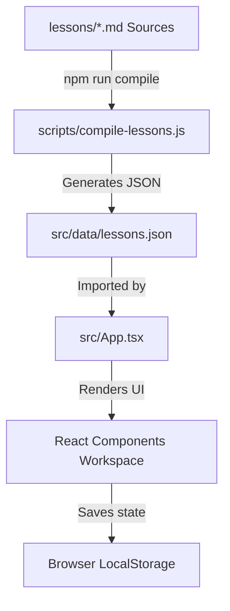

# 📘 TOEIC Practice Hub - Project Architecture & Upgrade Guide

This project is a Single Page Application (SPA) built with **React, Vite, TypeScript**, and **Vanilla CSS**. It integrates an automatic pre-compiler that converts Markdown (.md) note files into dynamic JSON data for the Frontend.

---

## 🛠️ Tech Stack

1. **Frontend Core**: React 18 & TypeScript (strongly typed).
2. **Build Tool**: Vite (optimizes dev server startup time and provides extremely fast production builds).
3. **Styling**: Vanilla CSS utilizing a flexible HSL color system combined with a minimalist **Glassmorphism** style, featuring default Dark Mode support.
4. **Icons**: Lucide React.
5. **Database**: Pre-compiled JSON file (`src/data/lessons.json`) generated from Markdown files.

---

## 📁 Project Directory Structure

```text
B12/
├── lessons/               # 📂 Storage for source Markdown files (Source of Truth)
│   ├── 12.md              # Lesson 12 file
│   └── 13.md              # Lesson 13 file (and future lessons)
├── scripts/               # 📂 Contains auxiliary build-time scripts
│   └── compile-lessons.js # Automatic Markdown -> JSON compiler
├── src/                   # 📂 React Frontend source code
│   ├── assets/            # React internal assets (logos, modular CSS, etc.)
│   ├── components/        # 🧩 Reusable UI Components
│   │   ├── AudioPlayer.tsx        # Audio player (speed controls, progress bar)
│   │   ├── Dashboard.tsx          # Homepage showing learning statistics and progress
│   │   ├── LessonWorkspace.tsx    # Workspace managing tabs and grading
│   │   ├── ListeningWorkspace.tsx # Workspace for Listening section (Transcript unlocks after grading)
│   │   ├── ReadingPassage.tsx     # Interactive reading passage (fills in blanks when options are selected)
│   │   ├── QuestionBlock.tsx      # Multiple-choice question block (A-B-C-D) with explanations
│   │   └── Sidebar.tsx            # Lesson list and quick question navigation panel
│   ├── data/
│   │   └── lessons.json   # 🗄️ JSON Database automatically generated after compilation
│   ├── types.ts           # TypeScript type definitions
│   ├── index.css          # Design System (CSS variables, fonts, HSL colors, animations)
│   ├── App.tsx            # Global state coordinator & LocalStorage history persistence
│   └── main.tsx           # React entry point
├── public/                # 📂 Static assets directory for Web Server
│   ├── assets/            # Contains lesson images/diagrams (e.g., 12_15.png)
│   └── audio/             # Contains listening MP3 files (e.g., lesson12.mp3)
├── package.json           # Package dependencies and run scripts
└── tsconfig.json          # TypeScript compiler configuration
```

---

## 🔄 Data Flow



### ⚡ Compiler Operation Rules:
- The compiler scans the `lessons/` directory to read all `.md` files.
- It uses precise Regular Expressions to parse syntax:
  - Extracts the **Listening** section based on the header `## 🎧 Part 3: Listening Comprehension`.
  - Extracts the **Reading** section based on the header `## 📖 Part 6-7: Reading Comprehension`.
  - Automatically identifies dialogue blocks formatted with speaker tags like `**[W-Am]**` or `**[M-Cn]**`.
  - Parses multiple-choice questions from the `#### 📝 Questions & Answers` block.
  - Automatically maps the correct answers for reading passages by looking for underlined phrases `<u>correct_answer</u> (question_code)` in the **Completed Version** and matching them back to the original **Options** list.

---

## 🚀 Scaling & Expansion Guide (Scaling to 21 Lessons)

When you want to add a new lesson (e.g., Lesson 14, 15, ..., 21), simply follow these standardized steps:

### Step 1: Prepare the Source Markdown File
- Create a new file in the `lessons/` directory named `14.md` (keep the exact same heading structure and emoji icons as `12.md` and `13.md` for the compiler to parse correctly).
- Verify that the required main headings match:
  - `## 🎧 Part 3: Listening Comprehension`
  - `## 📖 Part 6-7: Reading Comprehension`
  - Ensure the listening option choices prefix with `A.`, `B.`, `C.`, `D.` or `(A)`, `(B)`.
  - The correct answer prefix format in Listening is: `👉 **Answer: B**`.
  - The underlined answer format in Reading completed version is: `**<u>answer</u>** (question_code)`.

### Step 2: Add Audio & Graphic Assets
- **Listening Audio**: Save the corresponding audio file in the `public/audio/` directory named **`lesson14.mp3`** (allowing the app to load the correct track automatically).
- **Question Images**: If the exercises contain diagrams, maps, or charts (e.g., question 15 in lesson 14), save the image in the `public/assets/` directory named **`14_15.png`** (naming convention: `${lessonId}_${qNum}.png`). The app will automatically check for and display the image next to the corresponding question.

### Step 3: Run Compilation
- Run the following command to integrate the new lesson into the JSON database:
  ```bash
  npm run compile
  ```
- Alternatively, if you are running the development server, this command runs automatically before starting the server (`predev` script):
  ```bash
  npm run dev
  ```

---

## 💾 Progress Persistence

The app stores your practice progress (selected answers, scores, elapsed time, and completion date) in the browser's `localStorage` under the key `toeic_practice_progress`.
This allows you to close the browser and resume your work at any time without losing your progress history.
