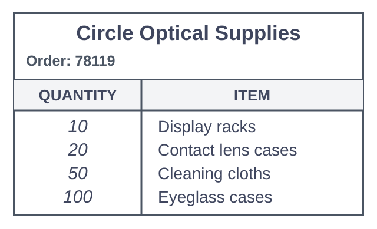

# Lesson 11 - Homework

---

## Listening Comprehension

### Questions 1-3

**[W-Br]**  
Hi, is this the Help Desk? This is Miranda Shin in Room 252B. I'm calling about a problem I'm having with my computer. I hear a loud whistling sound, like from a fan blowing.

**[M-Au]**  
OK, let's see if I can help you with that. I'd like you to shut the computer off and then turn it back on.

**[W-Br]**  
Actually, I've done that three times already. Unfortunately, it didn't help.

**[M-Au]**  
All right then. I have some time now, so I can come over to your office and try to figure this out.

#### Questions & Answers

1. **What department does the man probably work in?**  
   (A) Human Resources  
   (B) Accounting  
   (C) Technical Support  
   (D) Public Relations  
   **Answer: C**  
> **Explanation:** The woman calls the Help Desk about a computer problem, so the man most likely works in technical support.

2. **What does the man ask the woman to do?**  
   (A) Attend a meeting  
   (B) Write a report  
   (C) Check a manual  
   (D) Restart a computer  
   **Answer: D**  
> **Explanation:** He asks her to shut the computer off and turn it back on.

3. **What does the man say he can do?**  
   (A) Provide a reference  
   (B) Visit the woman's office  
   (C) Approve a request  
   (D) Select a project team  
   **Answer: B**  
> **Explanation:** He says he can come over to her office.

---

### Questions 4-6

**[W-Br]**  
Hello, Selwin Office Manufacturers. You've reached customer service. How may I help you today?

**[M-Au]**  
Yes, hello. I recently bought a used Selwin 6 label maker. The person I got it from no longer had the instructions, though, and I'm not sure how the machine works.

**[W-Br]**  
Unfortunately, that's an earlier model that we no longer produce.

**[M-Au]**  
Oh, no. That's a problem.

**[W-Br]**  
No, it's OK, because the Selwin 10 has a similar design, and the instructions should be nearly the same.

**[M-Au]**  
Great! Could you send me the instructions? My address is...

**[W-Br]**  
Actually, the manual for Selwin 10 is on our Web site. I can send you the link so you can download it.

#### Questions & Answers

4. **What does the woman mention about the Selwin 6?**  
   (A) It is easy to use.  
   (B) It is an earlier model.  
   (C) It is well designed.  
   (D) It is very popular.  
   **Answer: B**  
> **Explanation:** She says the Selwin 6 is an earlier model that is no longer produced.

5. **What does the man request?**  
   (A) A warranty  
   (B) A reimbursement  
   (C) A replacement part  
   (D) An instruction manual  
   **Answer: D**  
> **Explanation:** He asks her to send the instructions.

6. **What does the woman offer to do?**  
   (A) Reset a password  
   (B) Explain a policy  
   (C) Check part of an order  
   (D) Send a link to a Web site  
   **Answer: D**  
> **Explanation:** She offers to send him the link to the manual on the Web site.

---

### Questions 7-9

**[M-Au]**  
Hi, I'm calling from Skiller Building Repair Company. I got your message about the damaged wall in your store.

**[W-Am]**  
Yes. The damage was from a leaking water line. The leak's been repaired, but the wall behind the cash register has several cracks.

**[M-Au]**  
We can fix that for you.

**[W-Am]**  
Oh good! But I'd like to avoid closing the store early. Could you do the work in the evening?

**[M-Au]**  
Well, if you don't mind paying a slightly higher rate, I can get a crew in there after your regular hours.

**[W-Am]**  
OK, that'd be fine. Thanks!

#### Questions & Answers

7. **What problem are the speakers discussing?**  
   (A) A power failure  
   (B) A damaged wall  
   (C) A broken appliance  
   (D) A delayed delivery  
   **Answer: B**  
> **Explanation:** They discuss a damaged wall with several cracks.

8. **What does the woman want to avoid?**  
   (A) Adjusting her store's hours  
   (B) Relocating her business  
   (C) Purchasing some equipment  
   (D) Ruining some items  
   **Answer: A**  
> **Explanation:** She wants to avoid closing the store early.

9. **What does the woman agree to do?**  
   (A) Call back later  
   (B) Give away some merchandise  
   (C) Pay more for a service  
   (D) Provide customer feedback  
   **Answer: C**  
> **Explanation:** She agrees to pay a higher rate for evening repair work.

---

### Questions 10-12

**[M-Cn]**  
Hi, Gabriella. I wanted to talk to you about using the new online time reporting system. A lot of people have been asking about it.

**[W-Br]**  
Yes, well, I've been very busy. But I am planning the training session for early next week. That should make it quite clear to everyone.

**[M-Cn]**  
OK. But isn't there any written documentation?

**[W-Br]**  
What do you mean?

**[M-Cn]**  
You know, a guide that staff can follow in the meantime?

**[W-Br]**  
I don't think that's necessary. I'll have everyone go through the steps with me in the computer lab. Then they'll know exactly what to do. It's very simple.

#### Questions & Answers

10. **What are the speakers discussing?**  
    (A) Drafting a contract  
    (B) Working extra hours  
    (C) Using a new time reporting system  
    (D) Revising a vacation policy  
    **Answer: C**  
> **Explanation:** The man says he wants to talk about using the new online time reporting system.

11. **What does the man imply when he says, "A lot of people have been asking about it"?**  
    (A) Staff are confused about a procedure.  
    (B) People have heard that a workshop is interesting.  
    (C) Staff are waiting for a new assignment.  
    (D) A vacation calendar has not been posted yet.  
    **Answer: A**  
> **Explanation:** People asking about the system suggests they do not understand the procedure yet.

12. **What does the woman plan to do?**  
    (A) Lead some training  
    (B) Ask for assistance  
    (C) Take some time off  
    (D) Author a manual  
    **Answer: A**  
> **Explanation:** She says she is planning a training session and will guide everyone through the steps.

---

### Questions 13-15

**[W-Br]**  
Hi, I bought an electric piano from your store several months ago. It came with a one-year warranty. One of the keys on the keyboard isn't working now. Can you fix it for me?

**[M-Cn]**  
Of course! Do you have your original receipt? I'll need that to confirm that the piano's still under warranty.

**[W-Br]**  
Yes, here it is.

**[M-Cn]**  
Thanks! My colleague Ayako does all our keyboard repairs, but she's left for the day. When she comes back tomorrow, she'll be able to work on it.

**[W-Br]**  
OK. Umm ... I'm performing in a concert on Saturday. Do you think it'll be ready before then?

**[M-Cn]**  
Oh, definitely! These sorts of repairs take no more than a couple of hours.

#### Questions & Answers

13. **What is the purpose of the woman's visit?**  
    (A) To buy some sheet music  
    (B) To get an instrument repaired  
    (C) To check on a price  
    (D) To audition for a musical group  
    **Answer: B**  
> **Explanation:** She says a key on her electric piano is not working and asks if it can be fixed.

14. **What does the man request?**  
    (A) A credit card  
    (B) An address  
    (C) A receipt  
    (D) Photo identification  
    **Answer: C**  
> **Explanation:** He asks for the original receipt to confirm the warranty.

15. **What does the woman say she will do on Saturday?**  
    (A) Give a musical performance  
    (B) Return a product  
    (C) Meet a repair person  
    (D) Teach a piano lesson  
    **Answer: A**  
> **Explanation:** She says she is performing in a concert on Saturday.

---

### Questions 16-18

**[M-Au]**  
Are you going to the conference in London next month?

**[W-Br]**  
Yes, they asked me to give a presentation about my last project.

**[M-Au]**  
That's great. Do you know if the company will pay for your travel expenses?

**[W-Br]**  
They'll pay for the registration fee, but I have to cover the airfare myself. The company paid for my plane tickets to the conferences in January and March, and they only cover airfare for two conferences per year.

#### Questions & Answers

16. **What are the speakers discussing?**  
    (A) Travel agencies  
    (B) Foreign companies  
    (C) Conference attendance  
    (D) Application deadlines  
    **Answer: C**  
> **Explanation:** They discuss attending a conference in London.

17. **What is the woman going to do in London?**  
    (A) Give a presentation  
    (B) Meet with investors  
    (C) Take a tour of the city  
    (D) Interview for a job  
    **Answer: A**  
> **Explanation:** She says she was asked to give a presentation.

18. **What does the woman say about the registration fee?**  
    (A) It includes meals.  
    (B) It will be paid by the company.  
    (C) It is due in January.  
    (D) It can be paid by credit card.  
    **Answer: B**  
> **Explanation:** She says the company will pay for the registration fee.

---

### Questions 19-21

**[W-Am]**  
Hi, Mr. Olson? I'm Eun-hee Sohn from Circle Optical Supplies. I'm calling about the order you placed yesterday.

**[M-Cn]**  
Oh, yes - I ordered supplies for my eyeglass store. Is there an issue?

**[W-Am]**  
Well, we only have 25 of the eyeglass cases you ordered. Unfortunately, we won't have any more in stock for another two weeks.

**[M-Cn]**  
Oh, no - we have a promotional event starting next Friday, and we usually provide a case with each pair of eyeglasses our customers purchase. Hmmm ... I guess I'll take the 25 cases you have, but I'll have to order the rest from another company.

**[W-Am]**  
OK, I'll update your order. And as an apology, my manager told me to waive your delivery charge. So, we'll cover the twenty-dollar shipping fee.

#### Questions & Answers

19. **Why is the woman calling?**  
    (A) To upgrade an account  
    (B) To advertise a product  
    (C) To report a problem  
    (D) To provide an estimate  
    **Answer: C**  
> **Explanation:** She calls because the company only has 25 of the eyeglass cases ordered.

20. **Look at the graphic. What quantity on the original order form has to be changed?**  
    (A) 10  
    (B) 20  
    (C) 50  
    (D) 100  
    **Answer: D**  
> **Explanation:** The original order lists 100 eyeglass cases, but only 25 are available, so the quantity for eyeglass cases must be changed.

21. **What has the woman's manager instructed her to do?**  
    (A) Provide free shipping  
    (B) Send samples of new products  
    (C) Personally deliver an order  
    (D) Offer a discount on a future purchase  
    **Answer: A**  
> **Explanation:** Her manager told her to waive the delivery charge.
